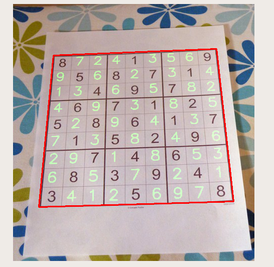
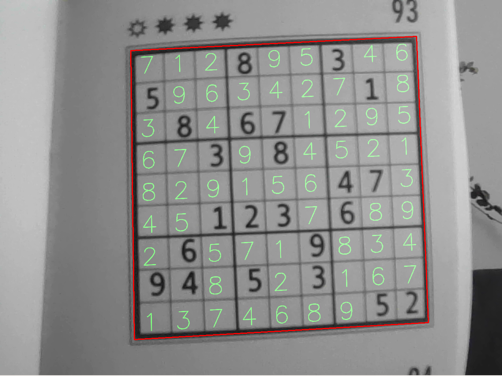

# Sudoku detector and solver



Goal of this project is to detect a sudoku on a video stream, extract the digits from it, then solve it to finally dislay the solution with the original perspective.

Detection and localization of the grid are mainly using OpenCV API.

One of the big challenges was to be able to recognize the printed characters in each entry of the sudoku. I started training a network on the MNIST dataset, but this method showed poor performances as human dont write digits in the exact same way than a computer. The neural network encountered many confusions between digits 1, 7 and 9. 

To tackle this issue, I generated my own dataset based on 10 famous fonts (Arial, Calibri, Times...) with a lot of data augmentation to ensure robustness. This rapidly showed much better performances and now, wrong classifications are becoming rare. The folder `ocr/` has everything you need to be able to repoduce the training phase. It uses Keras/Tensorflow.

In a second step, I wrote a sudoku solver based on a recursive approach. I am sure optimizations can 
be done to speed it up furtherly.

Enjoy!

## Demo

[](https://www.youtube.com/watch?v=tXa_gfmQnmw&ab_channel=antoinekeller)

## Repo description

```
.
├── images                        # 2 images of sudoku to use with sudoku_cv.py
│   ├── 1.jpeg
│   └── 2.png
├── ocr                           # Optical Character Recognition folder
│   ├── confusion_matrix.png      # used in README.md
│   ├── fonts                     # 10 common fonts for the neural network training
│   │   ├── arial.ttf
│   │   ├── calibri.ttf
│   │   ├── Cambria.ttf
│   │   ├── FranklinGothic.ttf
│   │   ├── futur.ttf
│   │   ├── Garamond.ttf
│   │   ├── Helvetica 400.ttf
│   │   ├── rock.ttf
│   │   ├── times.ttf
│   │   └── verdana.ttf
│   ├── model.h5                  # CNN weights
│   ├── model.json                # CNN description
│   ├── ocr_trainer.py            # The Keras neural network trainer
│   ├── README.md
│   └── test_examples.png         # used in README.md
├── README.md
├── solved.png                    # used in README.md
├── solver.py                     # the core algorithm to solve a sudoku
├── sudoku_cv.py                  # useful script to detect/solve a sudoku on an image
├── sudoku_locator.py             # class that detects and localize the grid
└── sudoku_webcam.py              # the main script that uses the webcam to detect/solve/track the sudoku
```

## sudoku_cv.py

For example, do:

```
$ ./sudoku_cv.py images/2.png 
Inference of 23 digits done in 0.266 seconds
+-------+-------+-------+
|       | 8     | 3     | 
| 5     |       |   1   | 
|   8   | 6 7   |       | 
+-------+-------+-------+
|     3 |   8   |       | 
|       |       | 4 7   | 
|     1 | 2 3   | 6     | 
+-------+-------+-------+
|   6   |     9 |       | 
| 9 4   | 5   3 |       | 
|       |       |   5 2 | 
+-------+-------+-------+
Solved sudoku in 0.403 seconds
+-------+-------+-------+
| 7 1 2 | 8 9 5 | 3 4 6 | 
| 5 9 6 | 3 4 2 | 7 1 8 | 
| 3 8 4 | 6 7 1 | 2 9 5 | 
+-------+-------+-------+
| 6 7 3 | 9 8 4 | 5 2 1 | 
| 8 2 9 | 1 5 6 | 4 7 3 | 
| 4 5 1 | 2 3 7 | 6 8 9 | 
+-------+-------+-------+
| 2 6 5 | 7 1 9 | 8 3 4 | 
| 9 4 8 | 5 2 3 | 1 6 7 | 
| 1 3 7 | 4 6 8 | 9 5 2 | 
```



## Requirements

This was tested under Python 3.9.12 in a Conda environment using Cuda.

A snippet of the conda list:

```
$ conda list
# packages in environment at /home/antoine/miniconda3/envs/tf:
#
# Name                    Version                   Build  Channel
cudatoolkit               11.2.2              hbe64b41_10    conda-forge
cudnn                     8.1.0.77             h90431f1_0    conda-forge
ffmpeg                    4.2.3                h167e202_0    conda-forge
fontconfig                2.13.1               h6c09931_0  
fonttools                 4.33.3                   pypi_0    pypi
jpeg                      9e                   h7f8727e_0  
keras                     2.3.1                    pypi_0    pypi
keras-applications        1.0.8                    pypi_0    pypi
keras-preprocessing       1.1.2              pyhd3eb1b0_0  
markdown                  3.3.7                    pypi_0    pypi
matplotlib                3.5.2                    pypi_0    pypi
matplotlib-base           3.4.3            py39hbbc1b5f_0  
numpy                     1.22.4                   pypi_0    pypi
numpy-base                1.16.6           py39h41b4c56_3  
opencv                    4.5.5            py39h905f02f_0  
pandas                    1.2.4            py39ha9443f7_0  
pillow                    9.1.1                    pypi_0    pypi
pip                       22.1.2                   pypi_0    pypi
pyqt                      5.9.2            py39h2531618_6  
pyqt5                     5.15.6                   pypi_0    pypi
pyqt5-qt5                 5.15.2                   pypi_0    pypi
pyqt5-sip                 12.10.1                  pypi_0    pypi
pysocks                   1.7.1            py39h06a4308_0  
python                    3.9.12               h12debd9_1  
python-dateutil           2.8.2              pyhd3eb1b0_0  
python_abi                3.9                      2_cp39    conda-forge
qt                        5.9.7                h5867ecd_1  
scikit-learn              1.0.2            py39h51133e4_1  
scipy                     1.7.3            py39h492baa0_0  
seaborn                   0.11.2             pyhd3eb1b0_0  
tensorboard               2.9.0                    pypi_0    pypi
tensorboard-data-server   0.6.1                    pypi_0    pypi
tensorboard-plugin-wit    1.8.1                    pypi_0    pypi
tensorflow                2.9.1                    pypi_0    pypi
tensorflow-base           2.4.1           mkl_py39h43e0292_0  
tensorflow-estimator      2.9.0                    pypi_0    pypi
tensorflow-io-gcs-filesystem 0.26.0                   pypi_0    pypi
```