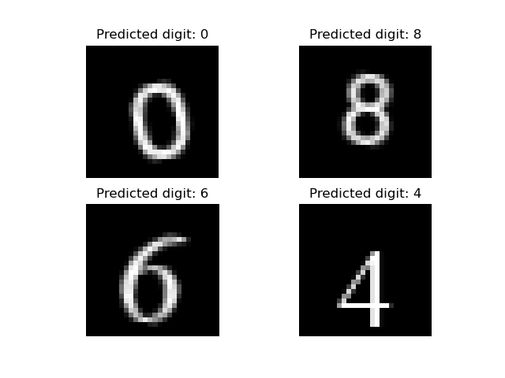
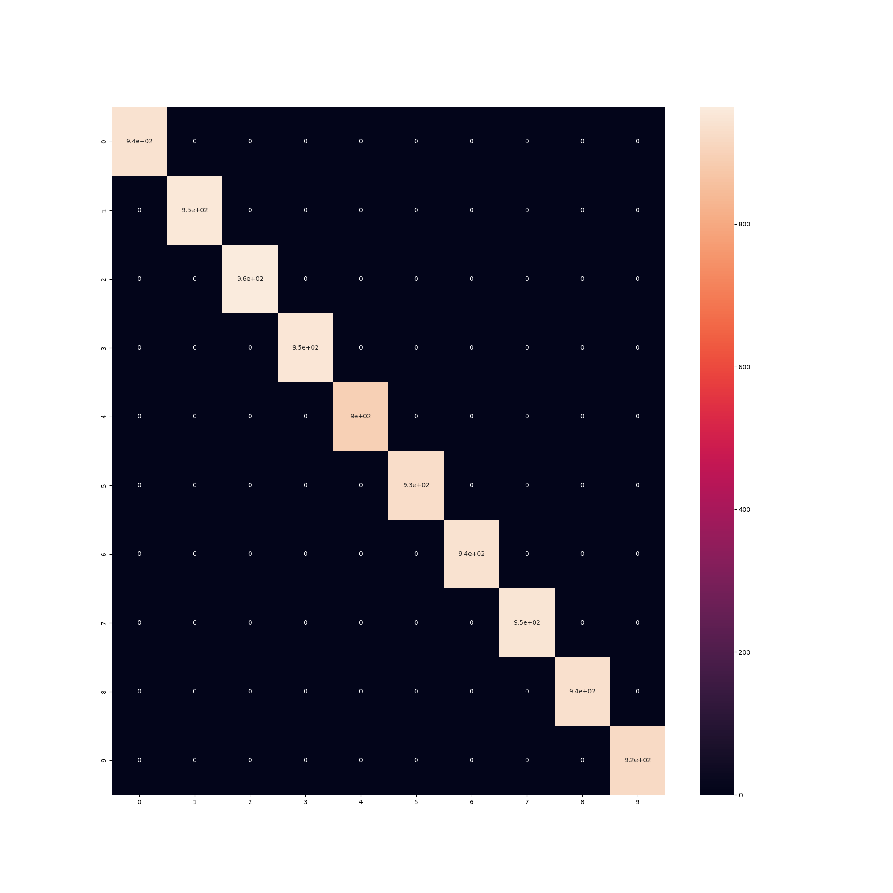

# Optical Character Recognition training with Keras

```
$ ./ocr_trainer.py -h
usage: ocr_trainer.py [-h] [--save] [--nb-epochs NB_EPOCHS]

Train a neural network on an auto-generated dataset to perform Optical Character Recognition

optional arguments:
  -h, --help            show this help message and exit
  --save                Save model to disk
  --nb-epochs NB_EPOCHS
                        Number of epochs for training
```

```
$ ./ocr_trainer.py --nb-epochs=5
Creating 62500 images with 10 fonts, 5 rotations, 5x5 translations and 5 different font sizes
Loaded training data with 53125 images of dimensions 28 x 28
Loaded test data with 9375 images of dimensions 28 x 28
Model: "sequential"
_________________________________________________________________
Layer (type)                 Output Shape              Param #   
=================================================================
conv2d (Conv2D)              (None, 24, 24, 32)        832       
_________________________________________________________________
max_pooling2d (MaxPooling2D) (None, 12, 12, 32)        0         
_________________________________________________________________
conv2d_1 (Conv2D)            (None, 10, 10, 16)        4624      
_________________________________________________________________
max_pooling2d_1 (MaxPooling2 (None, 5, 5, 16)          0         
_________________________________________________________________
dropout (Dropout)            (None, 5, 5, 16)          0         
_________________________________________________________________
flatten (Flatten)            (None, 400)               0         
_________________________________________________________________
dense (Dense)                (None, 128)               51328     
_________________________________________________________________
dense_1 (Dense)              (None, 64)                8256      
_________________________________________________________________
dense_2 (Dense)              (None, 10)                650       
=================================================================
Total params: 65,690
Trainable params: 65,690
Non-trainable params: 0
_________________________________________________________________
Epoch 1/5
266/266 [==============================] - 15s 54ms/step - loss: 1.0991 - accuracy: 0.6292 - val_loss: 0.0136 - val_accuracy: 0.9998
Epoch 2/5
266/266 [==============================] - 15s 55ms/step - loss: 0.0307 - accuracy: 0.9918 - val_loss: 0.0027 - val_accuracy: 0.9999
Epoch 3/5
266/266 [==============================] - 14s 54ms/step - loss: 0.0132 - accuracy: 0.9964 - val_loss: 0.0013 - val_accuracy: 0.9998
Epoch 4/5
266/266 [==============================] - 15s 56ms/step - loss: 0.0072 - accuracy: 0.9984 - val_loss: 4.6695e-04 - val_accuracy: 1.0000
Epoch 5/5
266/266 [==============================] - 15s 55ms/step - loss: 0.0042 - accuracy: 0.9990 - val_loss: 3.5928e-04 - val_accuracy: 1.0000
CNN Error:0.00
[[1.0000000e+00 2.6114140e-16 4.3072736e-21 7.4368298e-27 1.6178457e-13
  1.4775270e-22 2.5528338e-12 5.1351441e-16 6.6653137e-12 2.1197893e-10]
 [7.9876852e-09 9.9209321e-12 4.0410510e-16 6.5016094e-14 1.6761971e-14
  1.9805245e-06 7.7047854e-11 4.7942265e-13 3.7133809e-08 9.9999797e-01]
 [9.8010851e-08 2.5459731e-15 5.4011810e-17 3.7495987e-20 7.7482474e-14
  1.2132945e-07 9.9999976e-01 2.2409620e-12 1.4868239e-08 2.0207606e-11]
 [1.1088449e-12 2.2607302e-10 1.0000000e+00 3.7078322e-12 3.6991993e-16
  8.1010866e-17 4.2261510e-23 2.5735765e-09 5.7831181e-13 1.6514337e-12]
 [1.4153190e-15 8.6853717e-15 1.6119510e-12 2.3297084e-19 1.6077953e-25
  1.7513639e-14 1.6863056e-17 1.0000000e+00 6.8923154e-18 1.0995245e-18]]
Test images shape: (4, 28, 28)
Predicted digit: 0
Predicted digit: 8
Predicted digit: 6
Predicted digit: 4
```

This will display a few inference examples:



and the confusion matrix

